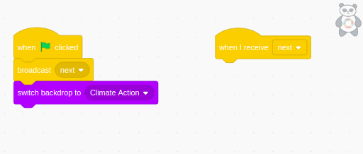

## Walk through the goals

You will program the **Main Panda** sprite to walk through a different backdrop for each goal.

--- task ---

**Online:** open the [starter project](http://rpf.io/p/en/projectName-on){:target="_blank"} in Scratch.

**Offline:** open the project [starter file](http://rpf.io/p/en/projectName-get){:target="_blank"} in the Scratch offline editor. If you need to download and install Scratch, you can find it [here](https://scratch.mit.edu/download){:target="_blank"}.

The Scratch environment that you will open looks like this:


--- /task ---

You will be programming the **Main Panda** sprite to walk through each of the five Green Goal backdrops.

--- task ---

--- no-print ---
Watch this short video, which shows what to do next.


--- /no-print ---

--- /task ---

You will be using the `Broadcast`{:class="block3events"} blocks which are messages that are sent by a sprite for some or all other sprites to receive. You'll be familiar with `Broadcasts`{:class="block3events"} if you completed the [Focus on the prize](https://learning-admin.raspberrypi.org/en/projects/focus-on-the-prize){:target="_blank"} project in the [Look after yourself](https://projects.raspberrypi.org/en/pathways/look-after-yourself){:target="_blank"} pathway.

Now follow each task given below.

The **Main Panda** sprite will have two scripts. The first script will set up the animation sequence for the backdrops. The second script is for the **Main Panda** sprite to continue its animation through the five green goals.

--- task ---

Create the first script for **Main Panda**. In the `Events`{:class="block3events"} blocks menu, select the following blocks: `when green flag clicked`{:class="block3events"} and `broadcast message1`{:class="block3events"}. Click on the dropdown in `broadcast message1`{:class="block3events"} block and select new message then title it 'next'.

```blocks3
when green flag clicked
broadcast [next v]
```

--- /task ---

--- task ---

Create the second script for **Main Panda**. In the `Events`{:class="block3events"} blocks menu, select the `when I receive next`{:class="block3events"} block:

```blocks3
when I receive [next v]
```
--- /task ---

--- task ---

Arrange the blocks so that you have two scripts. 



--- /task ---

Get the **Main Panda** sprite to enter from the bottom left-hand corner.

--- task ---

From the `Motion`{:class="block3motion"} menu, add a `go to x:() y:()`{:class="block3motion"} block. Change the coordinates to x: `-168` and y: `-87`:


```blocks3
when I receive [next v]
+ go to x: (-168) y: (-87)
```

--- /task ---

Show the **Main Panda** sprite at the beginning and hide it at the end.

--- task ---

Go to the `Looks`{:class="block3looks"} menu. Add the `show`{:class="block3looks"} and `hide`{:class="block3looks"} blocks:


```blocks3
when I receive [next v]
go to x: (-168) y: (-87)
+show
+hide
```

--- /task ---

Get the **Main Panda** sprite to move across the stage until it touches the edge of the stage.

--- task ---

To do this, add the following blocks: `repeat`{:class="block3control"} loop that repeats `move 10 steps`{:class="block3motion"} until the sprite is `touching edge`{:class="block3sensing"}:


```blocks3
when I receive [next v]
go to x: (-168) y: (-87)
show
+ repeat until <touching[edge v]>
  move (10) steps
end
hide
```

--- /task ---

--- task ---

Run your program to test it.

--- /task ---

You now need to program the next backdrop to appear when the **Main Panda** reaches the edge of the stage.

--- task ---
Now add the following two blocks to the end of the script: `broadcast next`{:class="block3events"} and `next backdrop`{:class="block3looks"} blocks:


```blocks3
when I receive [next v]
go to x: (-168) y: (-87)
show
repeat until <touching[edge v]>
  move (10) steps
end
hide
+ broadcast [next v]
+ next backdrop
```

--- /task ---

Now add the finishing touches. Get the **Main Panda** sprite to introduce the panda for each Green Goal by announcing each Green Goal's **Backdrop** title. And add some wait time so that the Green Goal pandas can explain their goal.

--- task ---
Add a `say backdrop name`{:class="block3looks"} and a `wait`{:class="block3control"} block:


```blocks3
when I receive [next v]
go to x: (-168) y: (-87)
show
+ say (backdrop [name v]) for (4) seconds
+ wait (12) seconds
repeat until <touching[edge v]>
  move (10) steps
end
hide
broadcast [next v]
next backdrop
```

--- /task ---

--- save ---
