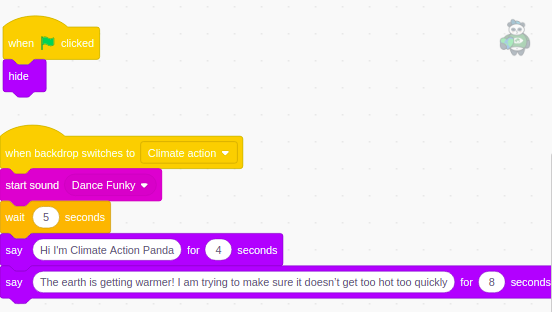
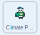

## Climate Action

In this step, you will program the **Climate Panda** sprite to explain the United Nations Sustainable Development Goal, [Climate Action](https://www.undp.org/content/undp/en/home/sustainable-development-goals/goal-13-climate-action.html){:target="\_blank"}, with a specific action, sound, and setting.

--- task ---

Click on the **Climate Panda** sprite in the Sprite list and go to the **Code** tab.

You will see some code already provided for you. The code includes music and text that explains the 'Climate Action' goal, as well as a script that gets the **Climate Panda** sprite to `hide`{:class="block3looks"} `when green flag clicked`{:class="block3events"}.



--- /task ---

Program the **Climate Panda** sprite to respond to the `broadcast`{:class="block3events"} sent by the **Main Panda** sprite. (You set this up in the previous step.)

--- task ---

Add a `when backdrop switches to Climate action`{:class="block3events"} block and use a `show`{:class="block3looks"} block to show the **Climate Panda** sprite on the Stage:



```blocks3
when backdrop switches to [Climate action v]
show
```

--- /task ---

Reduce the size of the **Climate Panda** sprite so that it fits within the scene.

--- task ---

Add a `set size to`{:class="block3looks"} block and set the size to `50` (percent):


```blocks3
when backdrop switches to (Climate action v)
+ set size to (50) %
show
```

--- /task ---

In the code that was already provided, there is a `wait 5 seconds`{:class="block3control"} block. It means that the **Climate Panda** sprite waits for 5 seconds while the **Main Panda** sprite introduces it.

--- task ---

Add a block so that the **Climate Panda** sprite will `wait 5 seconds`{:class="block3control"} before it moves:


```blocks3
when backdrop switches to (Climate action v)
set size to (50) %
show
+ wait (5) seconds
```

--- /task ---

--- task ---

Add blocks so that after it `waits 5 seconds`{:class="block3control"}, the **Climate Panda** sprite gets bigger and smaller repeatedly:


```blocks3
when backdrop switches to (Climate action v)
set size to (50) %
show
wait (5) seconds
+ repeat (18)
  change size by (5)
  wait (0.2) seconds
  change size by (-5)
  wait (0.2) seconds
end
```

--- /task ---

Now, program the **Climate Panda** sprite to respond to the `next`{:class="block3events"} `broadcast`{:class="block3events"} from the **Main Panda** sprite and `hide`{:class="block3looks"} when it has finished explaining its goal.

--- task ---

Start a new script with the `when I receive next`{:class="block3events"} and `hide`{:class="block3looks"} blocks:


```blocks3
when I receive [next v]
hide
```

--- /task ---

--- task ---

Test your program with the new sprite and backdrop.

--- /task ---

--- save ---
