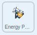

## Affordable and Clean Energy

In this step, you will program the **Energy Panda** sprite to respond to the United Nations Sustainable Development Goal, [Affordable and Clean Energy](https://www.undp.org/content/undp/en/home/sustainable-development-goals/goal-7-affordable-and-clean-energy.html){:target="\_blank"}, with a specific action, sound, and setting.

--- task ---

Go to the **Code** tab for the **Energy Panda** sprite.

You will see some code already provided for you. The code includes music and text that explains the 'Affordable and Clean Energy' goal, as well as a script that gets the **Energy Panda** sprite to `hide`{:class="block3looks"} `when green flag clicked`{:class="block3events"}.

--- /task ---

Program the **Energy Panda** sprite to respond to the `broadcast`{:class="block3events"} sent by the **Main Panda** sprite.

--- task ---

Add a `when backdrop switches to Affordable and clean energy`{:class="block3events"} block and use a `show`{:class="block3looks"} block to show the **Energy Panda** sprite on the Stage when the backdrop changes:



```blocks3
when backdrop switches to [Affordable and clean energy v]
show
```

--- /task ---

--- task ---

Add a `point in direction`{:class="block3motion"} block and set the value to `90` so that the **Energy Panda** sprite faces towards the right-hand side while it appears to interact with the **Main Panda** sprite:


```blocks3
when backdrop switches to (Affordable and clean energy v)
+ point in direction (90)
show
```

--- /task ---

Just like the **Climate Panda** sprite, the **Energy Panda** sprite needs to wait to be introduced by the **Main Panda** sprite.

--- task ---

Add a `wait 5 seconds`{:class="block3control"} block:


```blocks3
when backdrop switches to (Affordable and clean energy v)
point in direction (90)
show
+ wait (5) seconds
```
--- /task ---

Now, you want the **Energy Panda** sprite to respond by moving, this time from side to side.

--- task ---

Use the following blocks inside a `repeat`{:class="block3control"} loop: `turn right`{:class="block3motion"}, `wait`{:class="block3control"}, `turn left`{:class="block3motion"}, and `wait`{:class="block3control"}. Set the values in the `turn right`{:class="block3motion"} and `turn left`{:class="block3motion"} blocks to `15` (degrees), and set the values in the `wait`{:class="block3control"} blocks to `0.2` (seconds). Set the value in the `repeat`{:class="block3control"} block to `18`.


```blocks3
when backdrop switches to (Affordable and clean energy v)
point in direction (90)
show
wait (5) seconds
+ repeat (18)
  turn right (15) degrees
  wait (0.2) seconds
  turn left (15) degrees
  wait (0.2) seconds
end
```

--- /task ---

Program the **Energy Panda** sprite to respond to the next `broadcast`{:class="block3events"} from the **Main Panda** sprite and `hide`{:class="block3looks"} when it has finished explaining its goal.

--- task ---

Start a new script with the `when I receive next`{:class="block3events"} and `hide`{:class="block3looks"} blocks:


```blocks3
when I receive [next v]
hide
```

--- /task ---

--- task ---

Test your program with the new sprite and backdrop.

--- /task ---

--- save ---
