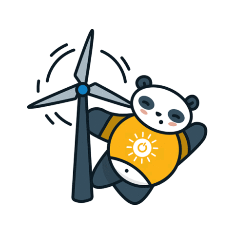

## Responsible Consumption and Production

This panda is called RRR to stand for 'Reuse, Reduce, Recycle'. In this step, you will program the **RRR Panda** sprite to respond to the United Nations Sustainable Development Goal, [Responsible Consumption and Production](https://www.undp.org/content/undp/en/home/sustainable-development-goals/goal-12-responsible-consumption-and-production.html){:target="\_blank"}, with a specific action, sound, and setting.

--- task ---

Go to the **Code** tab for the **RRR Panda** sprite.

You will see some code already provided for you. The code includes music and text that explains the 'Responsible Consumption and Production' goal, as well as a script that gets the **RRR Panda** sprite to `hide`{:class="block3looks"} `when green flag clicked`{:class="block3events"}.

--- /task ---

Program the **RRR Panda** sprite to respond to the `broadcast`{:class="block3events"} sent by the **Main Panda** sprite.

--- task ---

Add a `when backdrop switches to Responsible consumption and production`{:class="block3events"} block and use a `show`{:class="block3looks"} block to show the **RRR Panda** sprite on the Stage when the backdrop changes:


```blocks3
when backdrop switches to [Responsible consumption and production v]
show
```

--- /task ---

Just like the **Climate Panda** and **Energy Panda** sprites, the **RRR Panda** sprite needs to wait to be introduced by the **Main Panda** sprite.

--- task ---

Add a `wait 5 seconds`{:class="block3events"} block:


```blocks3
when backdrop switches to (Responsible consumption and production v)
show
+ wait (5) seconds
```
--- /task ---

To get the **RRR Panda** sprite to move, duplicate the code that you created in the **Energy Panda** sprite.

--- no-print ---

Watch this short video, which shows what to do next, then follow the instructions below.


--- /no-print ---

--- task ---

Go to the **Code** tab for the **Energy Panda** sprite and find the `repeat`{:class="block3control"} loop that you used to get the sprite to move. It should look like this:



```blocks3
when backdrop switches to (Affordable and clean energy v)
point in direction (90)
show
wait (5) seconds
+ repeat (18)
  turn right (15) degrees
  wait (0.2) seconds
  turn left (15) degrees
  wait (0.2) seconds
end
```

--- /task ---

--- task ---

Click on the `repeat`{:class="block3control"} loop to highlight it. Make sure that only the five blocks that you need are highlighted (not the whole script).

--- /task ---

--- task ---

Drag these blocks into the image of the **RRR Panda** sprite in the Sprite list and put them in the script that you started earlier in this step:


```blocks3
when backdrop switches to [Responsible consumption and production v]
show
wait (5) seconds
+ repeat (18)
  turn right (15) degrees
  wait (0.2) seconds
  turn left (15) degrees
  wait (0.2) seconds
end
```

--- /task ---

Program the **RRR Panda** sprite to respond to the `broadcast next`{:class="block3events"} command from the **Main Panda** sprite and `hide`{:class="block3looks"} when it has finished explaining its goal.

--- task ---

Start a new script with the `when I receive next`{:class="block3events"} and `hide`{:class="block3looks"} blocks:


```blocks3
when I receive [next v]
hide
```

--- /task ---

--- task ---

Test your program with the new sprite and backdrop.

--- /task ---

--- save ---
