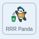
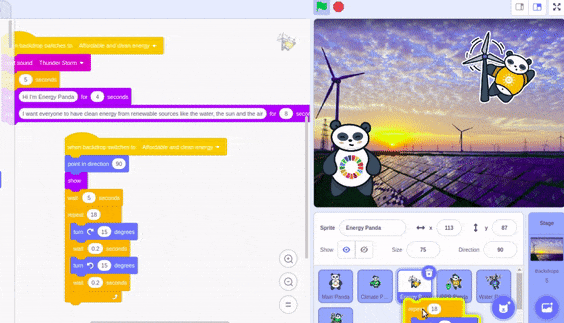

## Responsible consumption and development

This Green Goals panda is called RRR to stand for Reuse, Reduce, Recycle. Get the **RRR Panda** sprite to respond to the United Nations' Sustainable Development Goal, [Responsible consumption and production](https://www.undp.org/content/undp/en/home/sustainable-development-goals/goal-12-responsible-consumption-and-production.html){:target="\_blank"}, with a specfic action, sound and setting.

--- task ---

Go to the **Code** tab for the **RRR Panda**.

You will see some code  already provided for you. The code includes music and text explaining the Responsible consumption and production goal as well as a script that gets the **RRR Panda** sprite to `hide`{:class="block3looks"} `when flag clicked`{:class="block3events"}.

--- /task ---

Get the **RRR Panda** sprite to respond to the `broadcast`{:class="block3events"} in the **Main Panda** sprite.

--- task ---

Add a `when backdrop switches to Responsible comsumption and production`{:class="block3events"} block and use a `show`{:class="block3looks"} block to show the **RRR Panda** sprite on the stage when it receives the broadcast message:



```blocks3
when backdrop switches to [Responsible consumption and production v]
show
```

--- /task ---

As with the other Green Goals sprites, the **RRR Panda** sprite needs to wait to be introduced by the **Main Panda** sprite.

--- task ---

Add the `wait`{:class="block3events"} block to `5` seconds.


```blocks3
when backdrop switches to (Responsible consumption and production v)
show
+ wait (5) seconds
```
--- /task ---

To get the **RRR Panda** sprite to move, duplicate the code which you have previous created in the **Energy Panda** sprite.

--- no-print ---

Watch this short video, which shows what to do next, then follow the instructions below.



--- /no-print ---

--- task ---

Go to the **Code** tab for the **Energy Panda** sprite and find the repeat loop you used to get the sprite to move. It should look like this:


```blocks3
when backdrop switches to (Affordable and clean energy v)
point in direction (90)
show
wait (5) seconds
+ repeat (18)
  turn right (15) degrees
  wait (0.2) seconds
  turn left (15) degrees
  wait (0.2) seconds
end
```

--- /task ---

--- task ---

Highlight the repeat loop by clicking on it. Make sure only the 5 blocks you need are highlighted (not the whole script).

--- /task ---

--- task ---

Drag these blocks into the image of the **RRR Panda** sprite and make sure you put them in the script you started earlier in this step:


GIF HERE?

```blocks3
when backdrop switches to [Responsible consumption and production v]
show
wait (5) seconds
+ repeat (18)
  turn right (15) degrees
  wait (0.2) seconds
  turn left (15) degrees
  wait (0.2) seconds
end
```

--- /task ---

Get the **RRR Panda** sprite to respond to the next `broadcast`{:class="block3events"} from the **Main Panda** sprite and `hide`{:class="block3looks"} when it is finished explaining its goal.

--- task ---

Start a new script with the `when I receive next`{:class="block3events"} and `hide`{:class="block3looks"} blocks:


```blocks3
when I receive [next v]
hide
```

--- /task ---

--- task ---

Now test your program with the new sprite and backdrop.

--- /task ---

--- save ---
