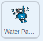

## Life below Water

Get the **Water Panda** sprite to respond to the United Nations' Sustainable Development Goal, [Life Below Water](https://www.undp.org/content/undp/en/home/sustainable-development-goals/goal-14-life-below-water.html){:target="\_blank"}, with a specfic action, sound and setting.

--- task ---

Go to the **Code** tab for the **Water Panda**.

You will see some code already provided for you. The code includes music and text explaining the Life Below Water goal as well as a script that gets the **Water Panda** sprite to `hide`{:class="block3looks"} `when flag clicked`{:class="block3events"}.

--- /task ---

Get the **Water Panda** sprite to respond to the `broadcast`{:class="block3events"} in the **Main Panda** sprite.

--- task ---

Add a  `when backdrop switches to Life Below Water`{:class="block3events"} block and use a `show`{:class="block3looks"} block to show the **Water Panda** sprite on the stage:



```blocks3
when backdrop switches to [Life Below Water v]
show
```

--- /task ---

--- task ---

Get the **Water Panda** sprite to point straight up so it only moves up and down the stage, and only rotates left and right:


```blocks3
when backdrop switches to (Life Below Water v)
+ point in direction (0)
+ set rotation style [left-right v]
show
```

--- /task ---

As with the previous Green Goals sprites, **Water Panda** sprite needs to wait to be introduced by the **Main Panda** sprite.

--- task ---

Add a `wait`{:class="block3control"} block for `5` seconds:


```blocks3
when backdrop switches to (Life Below Water v)
point in direction (0)
set rotation style [left-right v]
show
+ wait (5) seconds
```
--- /task ---

--- task ---

Add a `repeat until`{:class="block3control"} block so that the **Water Panda** sprite does `not`{:class="block3operators"} move unless the `backdrop of stage`{:class="block3sensing"} `=`{:class="block3operators"} `4`. The value 4 stands for the 4th backdrop - Life below Water:


```blocks3
when backdrop switches to (Life Below Water v)
point in direction (0)
set rotation style [left-right v]
show
wait (5) seconds
+ repeat until <not <([backdrop # v] of [stage v])= (4)>>
end
```
--- /task ---

You now need to make the  **Water Panda** sprite swim up to the top of the stage and back down again.

--- task ---
To do this add two `Motion`{:class="block3motion"} blocks: `move 2 steps`{:class="block3motion"} and `if on edge, bounce`{:class="block3motion"}:

```blocks3
when backdrop switches to (Life Below Water v)
point in direction (0)
set rotation style [left-right v]
show
wait (5) seconds
repeat until <not <([backdrop # v] of [stage v])= (4)>>
+ move (2) steps
+ if on edge, bounce
end
```

--- /task ---

Get the **Water Panda** sprite to respond to the next `broadcast`{:class="block3events"} from the **Main Panda** sprite and `hide`{:class="block3looks"} when it is finished explaining its goal.

--- task ---

Start a new script with the `when I receive next`{:class="block3events"} and `hide`{:class="block3looks"} blocks:


```blocks3
when I receive [next v]
hide
```

--- /task ---

--- task ---

Now test your program with the new sprite and backdrop.

--- /task ---

--- save ---
