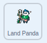

## Life on Land

Get the **Land Panda** sprite to respond to the United Nations Sustainable Development Goal, [Life on Land](https://www.undp.org/content/undp/en/home/sustainable-development-goals/goal-15-life-on-land.html){:target="\_blank"}, with a specific action, sound, and setting.

--- task ---

Go to the **Code** tab for the **Land Panda**.

You will see some code already provided for you. The code includes music and text that explains the 'Life on Land' goal, as well as a script that gets the **Land Panda** sprite to `hide`{:class="block3looks"} `when green flag clicked`{:class="block3events"}.

--- /task ---

Get the **Land Panda** sprite to respond to the `broadcast`{:class="block3events"} in the **Main Panda** sprite.

--- collapse ---

---
title: Click here for a reminder
---

Add a `when backdrop switches to Life on Land`{:class="block3events"} block and use a `show`{:class="block3looks"} block to show the **Land Panda** sprite on the Stage:



```blocks3
when backdrop switches to [Life on Land v]
show
```

--- /collapse ---

Change the size of the **Land Panda** sprite so that it fits into the scene.

--- task ---

To reduce the size of the **Land Panda** sprite, add a `set size to`{:class="block3looks"} block and change the value to `50` (percent):


```blocks3
when backdrop switches to (Life on Land v)
+ set size to (50) %
show
```

--- /task ---

As with the previous Green Goals sprites, before **Land Panda** sprite moves, it needs to wait to be introduced by the **Main Panda** sprite.

--- collapse ---

---
title: Click here for a reminder
---

Add a `wait`{:class="block3looks"} block and change its value to `5` seconds:


```blocks3
when backdrop switches to (Life on Land v)
set size to (50)%
show
+ wait (5) seconds
```
--- /collapse ---

Now, the **Land Panda** sprite needs to jump up and down.

--- task ---


Add a `repeat`{:class="block3control"} block, and within it, add the following blocks:

`change y by`{:class="block3motion"} block with a value of `10` (sprite goes up)
`wait`{:class="block3control"} block (slow down action)
`change y by`{:class="block3motion"} block with a value of `-10` (sprite goes down)
`wait`{:class="block3control"} block (slow down action)

```blocks3
when backdrop switches to (Life on Land v)
set size to (50)%
show
wait (5) seconds
+ repeat (18)
  change y by (10)
  wait (0.2) seconds
  change y by (-10)
  wait (0.2) seconds
end
```

--- /task ---

As in previous steps, get the **Land Panda** sprite to respond to the next `broadcast`{:class="block3events"} from the **Main Panda** sprite and `hide`{:class="block3looks"} when it has finished explaining its goal.

--- collapse ---

---
title: Click here for a reminder
---

Start a new script with the `when I receive next`{:class="block3events"} and `hide`{:class="block3looks"} blocks:


```blocks3
when I receive [next v]
hide
```

--- /collapse ---

--- task ---

Test your program with the new sprite and backdrop.

--- /task ---

--- save ---
